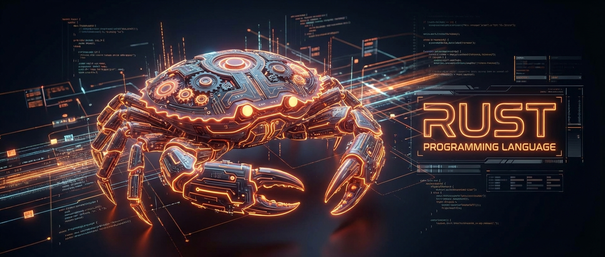

# Rust Learning Roadmap & Projects 🦀




Bu depo, Rust programlama dilini sıfırdan ileri seviyeye kadar öğrenmek için oluşturulmuş kapsamlı, proje bazlı bir yol haritasını ve bu harita kapsamında geliştirilen uygulamaları içerir.

## 🗺️ Yol Haritası

### Seviye 1: Temeller ve CLI Araçları (Beginner)
**Odak:** Syntax, Ownership/Borrowing, Temel Veri Tipleri, Kontrol Akışı.

- [x] **[Proje 1: To-Do List CLI](./todo_cli/README.md)**
  - *Açıklama:* Görev ekleme, silme ve listeleme özelliklerine sahip, verileri JSON olarak saklayan bir komut satırı aracı.
  - *Kazanımlar:* `struct`, `enum`, `clap` (CLI argümanları), `serde` (JSON serileştirme).

- [x] **[Proje 2: Minigrep (Grep Clone)](./minigrep/README.md)**
  - *Açıklama:* Dosya içinde metin arama yapan, büyük/küçük harf duyarlılığı seçeneği olan bir `grep` klonu.
  - *Kazanımlar:* Dosya okuma, string işleme, Iteratorler, Lifetime kavramı, Environment Variables.

### Seviye 2: Sistem Programlama ve Ağ (Intermediate)
**Odak:** Traits, Generics, Smart Pointers, Concurrency, Async/Await.

- [ ] **Proje 3: Çok Thread'li Web Server**
  - *Plan:* Sıfırdan HTTP sunucusu yazımı, Thread Pool implementasyonu.
  - *Kazanımlar:* TCP/IP, Thread yönetimi, `Arc` ve `Mutex`.

- [ ] **Proje 4: Gerçek Zamanlı Chat Uygulaması**
  - *Plan:* `tokio` kullanarak asenkron chat sunucusu ve istemcisi.
  - *Kazanımlar:* Async/Await, Stream işleme, Ağ programlama.

### Seviye 3: İleri Seviye ve Performans (Advanced)
**Odak:** Unsafe Rust, Macros, FFI, Gömülü Sistemler.

- [ ] **Proje 5: Key-Value Veritabanı**
  - *Plan:* Log-structured merge-tree tabanlı kalıcı veri saklama motoru.
  - *Kazanımlar:* Disk I/O, Binary formatlar, Bellek yönetimi.

- [ ] **Proje 6: Minimal İşletim Sistemi Çekirdeği**
  - *Plan:* Bare-metal üzerinde çalışan, ekrana yazı yazan mini kernel.
  - *Kazanımlar:* Düşük seviye donanım kontrolü, Paging, Interrupts.

## 🚀 Nasıl Kullanılır?

Her projenin kendi klasörü altında detaylı bir `README.md` dosyası bulunmaktadır. İlgili projeyi çalıştırmak için klasöre gidip `cargo run` komutunu kullanabilirsiniz.

Örnek (Minigrep için):
```bash
cd minigrep
cargo run -- "aranacak_metin" poem.txt
```

## 📚 Kaynaklar

1.  [The Rust Programming Language (The Book)](https://doc.rust-lang.org/book/)
2.  [Rust by Example](https://doc.rust-lang.org/rust-by-example/)
3.  [Rustlings](https://github.com/rust-lang/rustlings)
4.  [Jon Gjengset (YouTube)](https://www.youtube.com/c/JonGjengset)

---
*Bu proje [Gemini](https://deepmind.google/technologies/gemini/) ile pair programming yapılarak geliştirilmiştir.*
