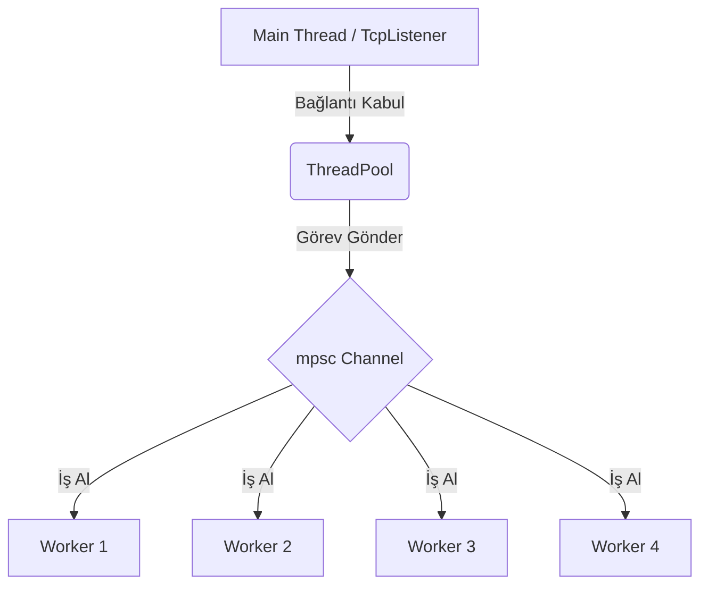

# Multi-Threaded Web Server 🌐

Bu proje, Rust öğrenim yol haritasının üçüncü adımıdır. Herhangi bir framework kullanmadan, sadece Rust standart kütüphanesi (`std`) ile yazılmış, çok iş parçacıklı (multi-threaded) bir HTTP sunucusudur.

## 🚀 Özellikler

- **Thread Pool:** Sabit sayıda (örn. 4) thread oluşturur. Gelen istekler bu havuzdaki boşta olan thread'ler tarafından işlenir.
- **Concurrency:** Uzun süren işlemler (simüle edilmiş `/sleep` isteği) sunucuyu bloklamaz, diğer istekler cevaplanmaya devam eder.
- **Graceful Shutdown:** Sunucu kapatıldığında (Ctrl+C), çalışan işlemlerin bitmesi beklenir.

## 🛠️ Kurulum ve Çalıştırma

```bash
cd hello_server
cargo run
```
Sunucu `127.0.0.1:7878` adresinde çalışmaya başlayacaktır.

## 📖 Kullanım Senaryoları

### 1. Normal İstek
Tarayıcıda `http://127.0.0.1:7878` adresine gidin.
**Sonuç:** `hello.html` sayfası yüklenir.

### 2. Eşzamanlılık (Concurrency) Testi
Bu test, sunucunun gerçekten multi-threaded çalıştığını kanıtlar.
```bash
# İlk istek 5 saniye uyur, ikinci istek hemen cevap vermelidir.
curl http://127.0.0.1:7878/sleep & curl http://127.0.0.1:7878
```
**Beklenen Davranış:** İkinci `curl` komutu, ilkinin bitmesini beklemeden hemen yanıt döner.

## 🏗️ Mimari ve Kod Yapısı

Sunucu, "Master-Worker" modelini kullanır:



### Temel Bileşenler

1.  **`ThreadPool`**:
    - İşçileri (`Worker`) oluşturur ve yönetir.
    - `execute` metodu ile gelen closure'ı (görevi) kanala gönderir.

2.  **`Worker`**:
    - Kendi thread'inde sonsuz döngüde çalışır.
    - Kanaldan (`Receiver`) iş gelmesini bekler ve gelen işi çalıştırır.
    - `Arc<Mutex<Receiver<Job>>>` yapısı sayesinde tüm işçiler aynı kanalı güvenli bir şekilde dinler.

3.  **`handle_connection`**:
    - TCP akışını okur.
    - HTTP isteğini parse eder ("GET / HTTP/1.1").
    - Uygun yanıtı (`200 OK` veya `404 NOT FOUND`) oluşturup geri yazar.
